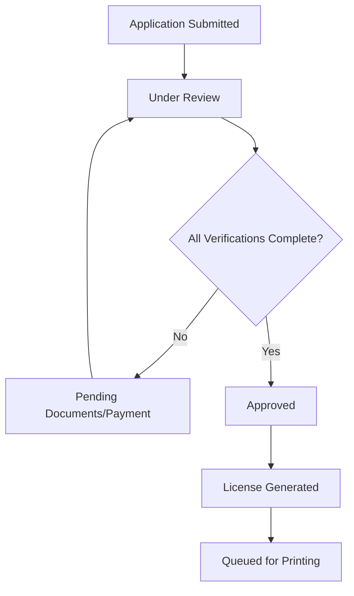
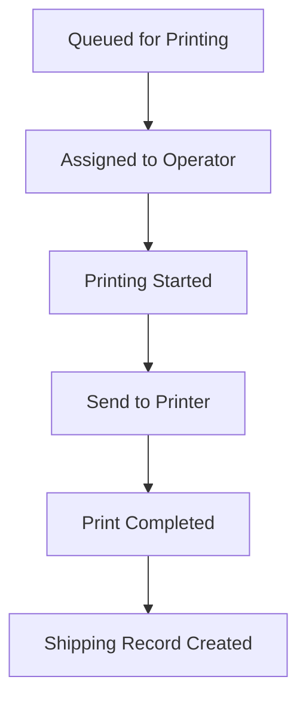
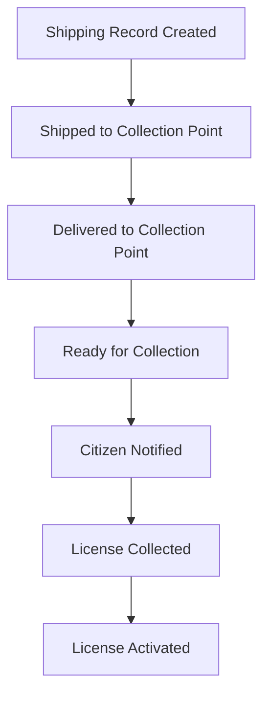

# Enhanced AMPRO License Workflow System

## Overview

The enhanced AMPRO license workflow system provides a complete end-to-end solution for African driver's license processing, from application approval to physical card collection. This system is designed to handle approximately 150,000 license renewals per year with the capability to scale to 1 million annually.

## Key Features

### 1. Complete Workflow Management
- **Application Processing**: From submission to approval
- **License Generation**: Automated PDF creation for front, back, and watermark
- **Print Queue Management**: Organized printing workflow with priority handling
- **Shipping & Logistics**: Tracking from print facility to collection points
- **Collection Management**: Citizen notification and license activation

### 2. Enhanced Application Statuses

The system now includes comprehensive status tracking:

```
SUBMITTED → UNDER_REVIEW → PENDING_DOCUMENTS/PENDING_PAYMENT → 
APPROVED → LICENSE_GENERATED → QUEUED_FOR_PRINTING → 
PRINTING → PRINTED → SHIPPED → READY_FOR_COLLECTION → COMPLETED
```

**Status Definitions:**
- `SUBMITTED`: Initial application received
- `UNDER_REVIEW`: Being reviewed by staff
- `PENDING_DOCUMENTS`: Waiting for additional documents
- `PENDING_PAYMENT`: Waiting for payment verification
- `APPROVED`: Application approved, ready for license generation
- `LICENSE_GENERATED`: License files created successfully
- `QUEUED_FOR_PRINTING`: Added to print queue
- `PRINTING`: Currently being printed
- `PRINTED`: Physical card printed successfully
- `SHIPPED`: Sent to collection point
- `READY_FOR_COLLECTION`: Available for citizen collection
- `COMPLETED`: Collected by citizen, license active

### 3. Print Job Management

**Print Job Statuses:**
- `QUEUED`: Waiting in print queue
- `ASSIGNED`: Assigned to printer operator
- `PRINTING`: Currently being printed
- `COMPLETED`: Successfully printed
- `FAILED`: Print job failed
- `CANCELLED`: Print job cancelled

**Features:**
- Priority-based queue management (Normal, High, Urgent)
- Multi-printer support with automatic detection
- Cross-platform printing (Windows, macOS, Linux)
- Print job assignment and tracking
- Automatic PDF generation integration

### 4. Shipping & Collection System

**Shipping Statuses:**
- `PENDING`: Ready to ship
- `IN_TRANSIT`: Being shipped to collection point
- `DELIVERED`: Delivered to collection point
- `FAILED`: Shipping failed

**Features:**
- Tracking number generation
- Multiple shipping methods support
- Collection point management
- Delivery confirmation workflow

### 5. License Status Enhancement

**New License Statuses:**
- `PENDING_COLLECTION`: License issued but not collected
- `ACTIVE`: License collected and active
- `EXPIRED`: License has expired
- `SUSPENDED`: License suspended
- `REVOKED`: License revoked

## Technical Implementation

### Backend Components

#### 1. Enhanced Models (`app/models/license.py`)

**New Models:**
- `PrintJob`: Manages print queue and printing workflow
- `ShippingRecord`: Tracks shipping and delivery
- Enhanced `License` and `LicenseApplication` models

**Key Fields Added:**
- Collection point tracking
- Payment verification
- Print job relationships
- Shipping tracking
- Collection timestamps

#### 2. CRUD Operations (`app/crud/crud_print_job.py`)

**Print Job Operations:**
- Queue management with priority sorting
- User assignment and tracking
- Status transitions
- Statistics and reporting

**Shipping Operations:**
- Shipping record management
- Tracking number handling
- Delivery confirmation
- Collection point filtering

#### 3. API Endpoints (`app/api/v1/endpoints/workflow.py`)

**Application Workflow:**
- `POST /workflow/applications/{id}/approve`: Approve application
- `GET /workflow/workflow/status/{id}`: Get complete workflow status

**Print Management:**
- `GET /workflow/print-queue`: Get current print queue
- `POST /workflow/print-jobs/{id}/assign`: Assign print job to user
- `POST /workflow/print-jobs/{id}/start`: Start printing process
- `POST /workflow/print-jobs/{id}/print`: Send to physical printer
- `POST /workflow/print-jobs/{id}/complete`: Mark as completed

**Shipping Management:**
- `GET /workflow/shipping/pending`: Get pending shipments
- `POST /workflow/shipping/{id}/ship`: Mark as shipped
- `POST /workflow/shipping/{id}/deliver`: Mark as delivered

**Collection Management:**
- `GET /workflow/collection-points/{point}/ready`: Get ready licenses
- `POST /workflow/licenses/{id}/collect`: Mark as collected

**Printer Management:**
- `GET /workflow/printers`: Get available printers
- `GET /workflow/printers/default`: Get default printer

**Statistics:**
- `GET /workflow/statistics/print-jobs`: Print job statistics
- `GET /workflow/statistics/shipping`: Shipping statistics

#### 4. Printing Service (`app/services/printing_service.py`)

**Cross-Platform Support:**
- Windows: PowerShell-based printing
- macOS: lpr command integration
- Linux: lpr command integration

**Features:**
- Automatic printer detection
- Default printer identification
- Multi-copy printing
- Error handling and reporting
- PDF file validation

### Frontend Components

#### 1. Workflow Manager (`src/components/WorkflowManager.tsx`)

**Features:**
- Real-time workflow monitoring
- Print queue management interface
- Shipping tracking dashboard
- Collection point management
- Statistics and reporting

**User Interface:**
- Tabbed interface for different workflow stages
- Real-time status updates
- Action buttons for workflow progression
- Modal dialogs for detailed operations
- Notification system for success/error feedback

### Database Migration

#### Migration File: `003_add_workflow_tables.py`

**Changes:**
- Add new enum types for print and shipping statuses
- Create `printjob` table with full tracking capabilities
- Create `shippingrecord` table for logistics management
- Add collection tracking fields to license table
- Add payment and collection fields to application table

## Workflow Process

### 1. Application Approval Process



### 2. Printing Process



### 3. Shipping & Collection Process



## Security & Compliance

### ISO Compliance
- Maintains ISO 18013-1 standards for driver license cards
- Secure file generation and storage
- Audit trail for all workflow actions
- Access control for sensitive operations

### Security Features
- Role-based access control
- Complete audit logging
- Secure file handling
- Transaction tracking
- User authentication for all operations

## Scalability Considerations

### Current Capacity: 150,000 licenses/year
- Optimized database queries with proper indexing
- Background task processing for license generation
- Efficient print queue management
- Batch processing capabilities

### Future Scaling to 1,000,000 licenses/year
- Horizontal scaling support
- Load balancing for print operations
- Distributed file storage
- Microservices architecture ready

## Installation & Setup

### Backend Setup

1. **Run Database Migration:**
```bash
cd "AMPRO Licence"
alembic upgrade head
```

2. **Install Dependencies:**
```bash
pip install -r requirements.txt
```

3. **Start the Server:**
```bash
python run.py
```

### Frontend Setup

1. **Install Dependencies:**
```bash
cd "AMPRO Core Frontend"
npm install
```

2. **Start Development Server:**
```bash
npm start
```

### Printer Setup

The system automatically detects available printers on the host system. For optimal performance:

1. **Windows**: Ensure PowerShell execution policy allows scripts
2. **macOS/Linux**: Ensure CUPS is properly configured
3. **Network Printers**: Configure through system printer settings

## API Usage Examples

### Approve an Application

```bash
curl -X POST "http://localhost:8000/api/v1/workflow/applications/123/approve" \
  -H "Authorization: Bearer YOUR_TOKEN" \
  -H "Content-Type: application/json" \
  -d '{"collection_point": "Main Office"}'
```

### Get Print Queue

```bash
curl -X GET "http://localhost:8000/api/v1/workflow/print-queue" \
  -H "Authorization: Bearer YOUR_TOKEN"
```

### Assign Print Job

```bash
curl -X POST "http://localhost:8000/api/v1/workflow/print-jobs/456/assign" \
  -H "Authorization: Bearer YOUR_TOKEN" \
  -H "Content-Type: application/json" \
  -d '{"print_job_id": 456, "user_id": 2}'
```

### Print License Card

```bash
curl -X POST "http://localhost:8000/api/v1/workflow/print-jobs/456/print" \
  -H "Authorization: Bearer YOUR_TOKEN" \
  -H "Content-Type: application/json" \
  -d '{"printer_name": "HP LaserJet Pro", "copies": 1}'
```

## Monitoring & Analytics

### Key Metrics
- Print queue length and processing time
- Shipping delivery times
- Collection rates and timeframes
- Error rates and failure points
- User productivity metrics

### Reporting Features
- Daily/weekly/monthly workflow reports
- Performance analytics
- Bottleneck identification
- Capacity planning data

## Troubleshooting

### Common Issues

1. **Print Jobs Stuck in Queue**
   - Check printer connectivity
   - Verify printer driver installation
   - Review system permissions

2. **License Generation Failures**
   - Check file system permissions
   - Verify template file availability
   - Review background task logs

3. **Shipping Tracking Issues**
   - Verify collection point configuration
   - Check shipping method settings
   - Review delivery confirmation process

### Log Files
- Application logs: `app/logs/`
- Print service logs: System printer logs
- Database logs: PostgreSQL logs
- Audit trail: `audit_log` table

## Future Enhancements

### Planned Features
1. **Mobile Collection App**: For collection point staff
2. **SMS Notifications**: Citizen alerts for collection readiness
3. **Batch Printing**: Multiple licenses per print job
4. **Advanced Analytics**: Machine learning for optimization
5. **Integration APIs**: External system connectivity

### Performance Optimizations
1. **Caching Layer**: Redis for frequently accessed data
2. **CDN Integration**: Faster file delivery
3. **Database Optimization**: Query performance improvements
4. **Background Processing**: Celery task queue implementation

## Support & Maintenance

### Regular Maintenance Tasks
1. Database cleanup and optimization
2. File system cleanup for old PDFs
3. Print queue monitoring and cleanup
4. Audit log archival
5. Performance monitoring and tuning

### Backup Procedures
1. Daily database backups
2. File system backups for generated PDFs
3. Configuration backups
4. Disaster recovery procedures

## Contact & Support

For technical support or questions about the enhanced workflow system:
- Review this documentation
- Check the API documentation at `/docs`
- Review audit logs for troubleshooting
- Contact system administrators for access issues

---

*This enhanced workflow system provides a robust, scalable solution for African driver's license processing with full compliance to ISO standards and optimized for high-volume operations.* 